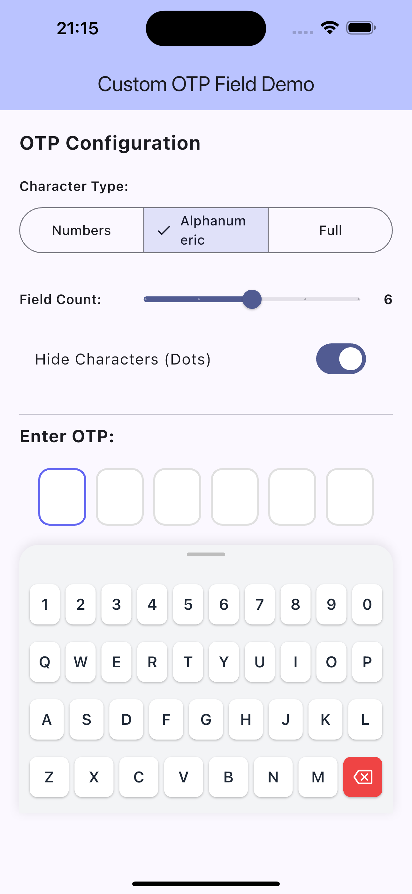
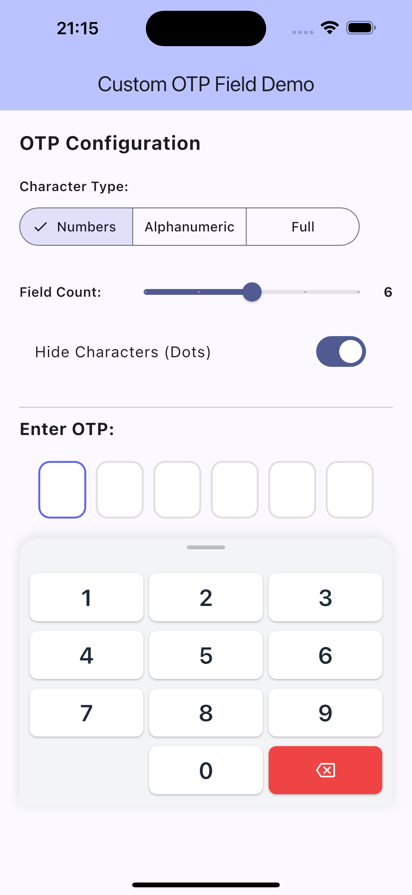
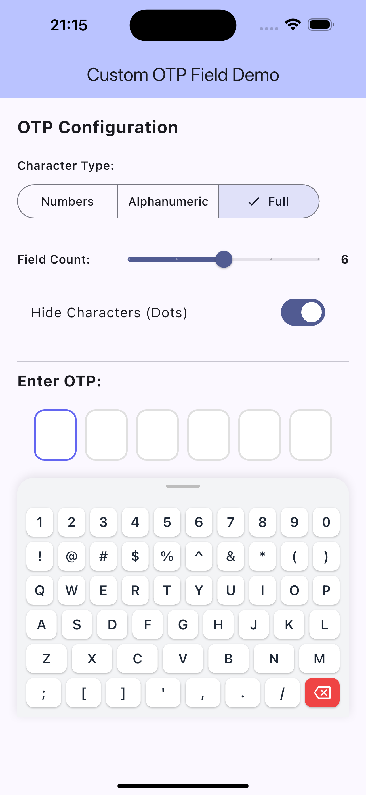

# Custom OTP Field 🔐

A highly customizable Flutter OTP (One-Time Password) input field package with a built-in custom keyboard. Perfect for secure authentication flows with support for numbers, alphanumeric, and special characters.

[](https://pub.dev/packages/custom_otp_field)
[](https://opensource.org/licenses/MIT)

## ✨ Features

- 🎨 **Fully Customizable** - Colors, sizes, borders, and styles
- ⌨️ **Custom Keyboard** - MacBook-style keyboard layout (no native keyboard needed)
- 🔢 **Multiple Character Types** - Numbers only, alphanumeric, or full character set
- 🔒 **Secure by Default** - 6+ character minimum recommended, masked input option
- 📱 **Responsive Design** - Adapts to different screen sizes
- 🎯 **Auto-Focus Management** - Smooth navigation between fields
- 🎭 **Masked/Visible Toggle** - Show dots or actual characters
- 🚀 **Modern Flutter** - Built with Flutter 3.x and Material 3
- 💯 **Null Safe** - Complete null safety support

## 📸 Screenshots

<table>
  <tr>
    <td></td>
    <td></td>
    <td></td>
  </tr>
  <tr>
    <td align="center">Alphanumeric Mode</td>
    <td align="center">Numbers Only</td>
    <td align="center">Full Characters</td>
  </tr>
</table>

## 🚀 Getting Started

### Installation

Add this to your package's `pubspec.yaml` file:

```yaml
dependencies:
  otp_numpad: ^0.0.1
```

Then run:

```bash
flutter pub get
```

### Import

```dart
import 'package:otp_numpad/otp_numpad.dart';
```

## 📖 Usage

### Basic Usage

```dart
OtpFieldWidget(
  config: OTPConfig(
    length: 6,
    characterType: CharacterType.alphanumeric,
    obscureText: true,
  ),
  onCompleted: (pin) {
    print('OTP Entered: $pin');
    // Verify with your backend
  },
)
```

### Numbers Only (Classic PIN)

```dart
OtpFieldWidget(
  config: OTPConfig(
    length: 4,
    characterType: CharacterType.numbersOnly,
    obscureText: false,
  ),
  onCompleted: (pin) {
    // Verify PIN
  },
)
```

### Full Customization

```dart
OtpFieldWidget(
  config: OTPConfig(
    length: 8,
    characterType: CharacterType.full,
    obscureText: true,
    
    // Field customization
    fieldWidth: 55.0,
    fieldHeight: 65.0,
    fieldSpacing: 12.0,
    borderRadius: 15.0,
    
    // Field colors
    borderColor: Colors.grey.shade300,
    focusedBorderColor: Colors.blue,
    filledBorderColor: Colors.green,
    
    // Keyboard customization
    keyboardHeight: 300.0,
    
    // Text style
    textStyle: TextStyle(
      fontSize: 28,
      fontWeight: FontWeight.bold,
      color: Colors.black,
    ),
  ),
  onChanged: (value) {
    print('Current value: $value');
  },
  onCompleted: (pin) {
    print('Completed: $pin');
  },
)
```

## 🎨 Customization Options

### Character Types

| Type | Description | Keyboard Layout |
|------|-------------|-----------------|
| `CharacterType.numbersOnly` | Numbers 0-9 only | 3x4 numeric keypad |
| `CharacterType.alphanumeric` | Letters and numbers | QWERTY + numbers |
| `CharacterType.full` | All characters including symbols | Full MacBook-style layout |

### Configuration Parameters

#### Field Settings

| Parameter | Type | Default | Description |
|-----------|------|---------|-------------|
| `length` | `int` | `6` | Number of OTP fields (4-8) |
| `characterType` | `CharacterType` | `alphanumeric` | Type of characters allowed |
| `obscureText` | `bool` | `true` | Show dots instead of characters |
| `fieldWidth` | `double` | `50.0` | Width of each field |
| `fieldHeight` | `double` | `60.0` | Height of each field |
| `fieldSpacing` | `double` | `10.0` | Space between fields |
| `borderRadius` | `double` | `12.0` | Border radius of fields |

#### Colors

| Parameter | Type | Default | Description |
|-----------|------|---------|-------------|
| `borderColor` | `Color` | `Color(0xFFE0E0E0)` | Default border color |
| `focusedBorderColor` | `Color` | `Color(0xFF6366F1)` | Border color when focused |
| `filledBorderColor` | `Color` | `Color(0xFF10B981)` | Border color when filled |

#### Callbacks

| Callback | Description |
|----------|-------------|
| `onChanged(String value)` | Called whenever the OTP value changes |
| `onCompleted(String value)` | Called when all fields are filled |

## 🔒 Security Recommendations

For maximum security, we recommend:

- ✅ Use at least **6 characters**
- ✅ Enable **alphanumeric** or **full character** mode
- ✅ Keep **obscureText** enabled (dots instead of visible characters)
- ✅ Implement rate limiting on your backend
- ✅ Use time-based expiration for OTPs
- ✅ Never store OTPs in plain text

## 🎯 Example App

Check out the [example](example/) directory for a complete demo app showcasing all features.

To run the example:

```bash
cd example
flutter pub get
flutter run
```

## 🛠️ Development

### Running Tests

```bash
flutter test
```

### Formatting Code

```bash
flutter format .
```

### Analyzing Code

```bash
flutter analyze
```

## 🤝 Contributing

Contributions are welcome! Please feel free to submit a Pull Request.

1. Fork the repository
2. Create your feature branch (`git checkout -b feature/amazing-feature`)
3. Commit your changes (`git commit -m 'Add some amazing feature'`)
4. Push to the branch (`git push origin feature/amazing-feature`)
5. Open a Pull Request

## 📝 License

This project is licensed under the MIT License - see the [LICENSE](LICENSE) file for details.

## 💖 Support

If you find this package helpful, please give it a ⭐️ on [GitHub](https://github.com/connelevalsam/secured_otp_and_numpad_package)!

## 📧 Contact

- **Author**: Connel Asikong
- **Email**: connelblaze@gmail.com
- **GitHub**: [@connelevalsam](https://github.com/connelevalsam)

## 🔄 Changelog

See [CHANGELOG.md](CHANGELOG.md) for a list of changes.

---

Made with ❤️ and Flutter
